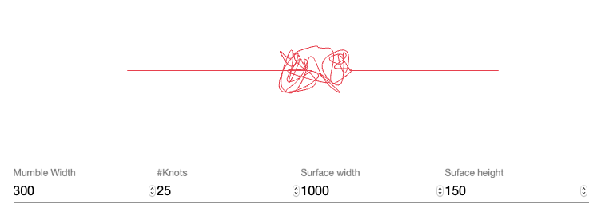

# Knot



Simple mumbler knot generator. Just enter the # of knots and the surface width and height and you'll get a randomized
mumble knot :-). - Those generated mumbles are used on the [mumbler website](https://www.mumbler.gmbh).


# About

Mumbler was born as an idealist idea to apply the principals of the "Briefgeheimnis" to the digital age. 
We are very low on budget and are currently solely founded through and legally constituted 
within the austrian-based startup company mumbler gmbh.

Further we're currently in the progress of setting up a Indiegogo campaign to help found the infrastructure costs. 
In the meantime it would be great if you could support our efforts by 
[donating a couple of euros](https://www.paypal.com/cgi-bin/webscr?cmd=_s-xclick&hosted_button_id=EZ2DJPABLJS6J).

## Support

Please support the project with your coding-, design-, brain-time and/or spread the word.

Of course **operating the infrastructure is a big issue** as well. 
It would be great if you could support us by donating a couple of euros:

[](https://www.paypal.com/cgi-bin/webscr?cmd=_s-xclick&hosted_button_id=EZ2DJPABLJS6J)

**Thank you very much and we'll hope you’re as excited as we are on the idea of bringing back the “Briefgeheimnis” 
to the digital age.**

## Code of conduct

Lust but not least please read the [COC.md](COC.md) file for details on our code of conduct. Contributing to the
mumbler initiative you implicitly agree to our code of conduct and the mumbler intention.

# Further information

The module follows the idea of the mumble initiative and utilizes its specifications. 

## Mumbler Initiative - The idea

The goal of the Mumbler initiative is to resurrect the german law concept of the 
“[Briefgeheimnis](https://de.wikipedia.org/wiki/Briefgeheimnis)” which translates to 
[secrecy of correspondence](https://en.wikipedia.org/wiki/Secrecy_of_correspondence) and is the basis for
privacy of correspondence. For centuries opening and/or reading a correspondence which was intended for 
someone else was a criminal act, often punished by jail time. The french King Louis XV even declared the death 
penalty on breaking the "Briefgeheimnis" (with his edict on 25. Sep 1742).

Today it is a well-known fact that all digital correspondence is stored somewhere and 
is read, analyzed, profiled and last but not least profited off by many parties.

The Mumbler initiative is convinced that it should be of paramount importance to keep the 
information where it belongs:
 
**Only in the hands of the communication parties themselves.**

The Mumbler initiative was created to achieve exactly that. Analog letters have/had the "Briefgeheimnis", 
digital correspondence have Mumbler.

Further information can be found at [mumbler initiative](https://github.com/mumbler)

## Mumbler Initiative - Initiator

Mumbler was created and is currently operated by:

```
mumbler gmbh
Jakob-Haringer-Str. 1
5020 Salzburg

hello@mumbler.eu
```
